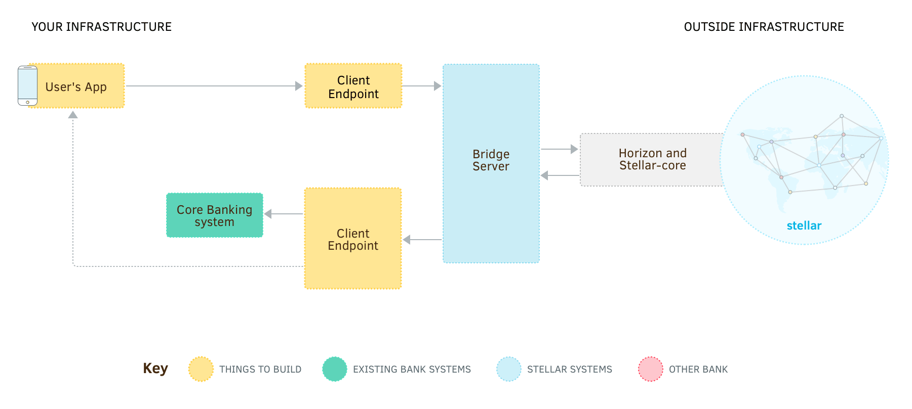
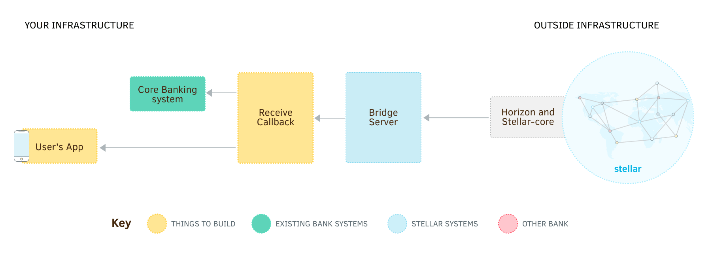

Stellar.org 维护了一个[桥接服务](https://github.com/stellar/bridge-server/blob/master/readme_bridge.md)，可以更加方便对接联邦服务和合规服务进行收发资产。使用桥接服务时，您仅需撰写一个私有服务，接收收付款提醒，以及响应来自桥接服务和合规服务的合规性检查。



使用桥接服务，您需要通过 HTTP Post 方式发送支付请求到桥接服务而不是 Horizon 服务。对于简单的收发工作，这并没有太多效率提升，但可以使联邦服务和合规工作变得容易得多。

## 创建数据库

桥接服务需要一个 MySQL 或 PostgreSQL 数据库，以追踪和协同事务及合规信息。创建一个名为 `stellar_bridge` 的空数据库和用户即可。您无需创建/添加任何表，桥接服务有[一个特殊命令会完成建表动作](#start-the-server)。

## 下载和配置桥接服务=

接下来，根据您的操作系统平台[下载最新版本的桥接服务](https://github.com/stellar/bridge-server/releases)。将其安装到任意地方，并在同一目录内创建一个名叫 `bridge.cfg` 的文件。该文件用于存储配置。如下所示：

<code-example name="bridge.cfg">

```toml
port = 8006
horizon = "https://horizon-testnet.stellar.org"
network_passphrase = "Test SDF Network ; September 2015"
# 当配置合规服务时，填写此处
compliance = ""

# 用于收发的资产，可以填写多个
[[assets]]
code="USD"
issuer="GAIUIQNMSXTTR4TGZETSQCGBTIF32G2L5P4AML4LFTMTHKM44UHIN6XQ"

[database]
type = "mysql"  # 或 "postgres" 如果你创建了一个 postgres 数据库
url = "dbuser:dbpassword@/stellar_bridge"

[accounts]
# 基本账户的密钥，用于向外支付
base_seed = "SAV75E2NK7Q5JZZLBBBNUPCIAKABN64HNHMDLD62SZWM6EBJ4R7CUNTZ"
# 用以代替客户进行接收支付的账号，这里我们使用基本账户
receiving_account_id = "GAIGZHHWK3REZQPLQX5DNUN4A32CSEONTU6CMDBO7GDWLPSXZDSYA4BU"
# 一个用于对你发行的资产进行授权(authorized)的账号密钥。
# 访问 https://stellar.org/developers/guides/concepts/assets.html#controlling-asset-holders 获取更多信息
# authorizing_seed = "SBILUHQVXKTLPYXHHBL4IQ7ISJ3AKDTI2ZC56VQ6C2BDMNF463EON65U"
# 资产发行账号
issuing_account_id = "GAIUIQNMSXTTR4TGZETSQCGBTIF32G2L5P4AML4LFTMTHKM44UHIN6XQ"

[callbacks]
# 桥接服务会发送 POST 请求到下述URL，通知到账。
receive = "http://localhost:8005/receive"
```

</code-example>


## 启动服务

在第一次启动服务之前，必须创建数据库表。使用 `--migrate-db` 参数运行桥接服务会确定万事俱备：

```bash
./bridge --migrate-db
```

每次升级升级桥接服务时，您都应运行此命令。这会在有变动时升级数据库。

现在您的数据库已经准备好，你可以使用下述命令启动服务：

```bash
./bridge
```


## 发起支付

桥接服务通过 HTTP 请求接受命令。所以我们可以试着通过向 `/payments` 发起一个 `POST` 请求来提交一笔支付。试试发送1美元到`GCFXHS4GXL6BVUCXBWXGTITROWLVYXQKQLF4YH5O5JT3YZXCYPAFBJZB`账户。（注意接收账号需要提前信任该资产，参看 [发行资产](../issuing-assets.md)）

<code-example name="Send a Payment">

```bash
curl -X POST -d \
"id=unique_payment_id&\
amount=1&\
asset_code=USD&\
asset_issuer=GAIUIQNMSXTTR4TGZETSQCGBTIF32G2L5P4AML4LFTMTHKM44UHIN6XQ&\
destination=GCFXHS4GXL6BVUCXBWXGTITROWLVYXQKQLF4YH5O5JT3YZXCYPAFBJZB&\
source=SAV75E2NK7Q5JZZLBBBNUPCIAKABN64HNHMDLD62SZWM6EBJ4R7CUNTZ" \
http://localhost:8006/payment
```

```js
var request = require('request');

request.post({
  url: 'http://localhost:8006/payment',
  form: {
    id: 'unique_payment_id',
    amount: '1',
    asset_code: 'USD',
    asset_issuer: 'GAIUIQNMSXTTR4TGZETSQCGBTIF32G2L5P4AML4LFTMTHKM44UHIN6XQ',
    destination: 'GCFXHS4GXL6BVUCXBWXGTITROWLVYXQKQLF4YH5O5JT3YZXCYPAFBJZB',
    source: 'SAV75E2NK7Q5JZZLBBBNUPCIAKABN64HNHMDLD62SZWM6EBJ4R7CUNTZ'
  }
}, function(error, response, body) {
  if (error || response.statusCode !== 200) {
    console.error('ERROR!', error || body);
  }
  else {
    console.log('SUCCESS!', body);
  }
});
```

```java
import org.apache.http.HttpEntity;
import org.apache.http.HttpResponse;
import org.apache.http.NameValuePair;
import org.apache.http.client.HttpClient;
import org.apache.http.client.methods.HttpPost;
import org.apache.http.impl.client.HttpClients;
import org.apache.http.message.BasicNameValuePair;
import org.apache.http.util.EntityUtils;

import java.util.ArrayList;
import java.util.List;

public class PaymentRequest() {
  public static void main(String [] args) {
    HttpPost paymentRequest = new HttpPost("http://localhost:8006/payment");

    List<NameValuePair> params = new ArrayList<NameValuePair>();
    params.add(new BasicNameValuePair("id", "unique_payment_id"));
    params.add(new BasicNameValuePair("amount", "1"));
    params.add(new BasicNameValuePair("asset_code", "USD"));
    params.add(new BasicNameValuePair("asset_issuer", "GAIUIQNMSXTTR4TGZETSQCGBTIF32G2L5P4AML4LFTMTHKM44UHIN6XQ"));
    params.add(new BasicNameValuePair("destination", "GCFXHS4GXL6BVUCXBWXGTITROWLVYXQKQLF4YH5O5JT3YZXCYPAFBJZB"));
    params.add(new BasicNameValuePair("source", "SAV75E2NK7Q5JZZLBBBNUPCIAKABN64HNHMDLD62SZWM6EBJ4R7CUNTZ"));

    HttpResponse response = httpClient.execute(paymentRequest);
    HttpEntity entity = response.getEntity();
    if (entity != null) {
      String body =  EntityUtils.toString(entity);
      System.out.println(body);
    }
  }
}
```

</code-example>


## 创建一个用于接收支付的服务



在桥接服务配置文件里,您可能已经注意到一个名为 `receive` 的回调URL。只要收到付款,桥接服务将发送一个 HTTP `POST` 请求到您指定的这个URL。此 `receive` 回调的主要职责就是收到付款时更新客户的资产（因为付款是到你指定的账户上的）。

<code-example name="Implementing the Receive Callback">

```js
/**
 * A small Express.js web server for handling payments from the bridge server.
 */

var express = require('express');
var bodyParser = require('body-parser');

var app = express();
app.use(bodyParser.urlencoded({ extended: false }));

app.post('/receive', function (request, response) {
  var payment = request.body;

  // `receive` may be called multiple times for the same payment, so check that
  // you haven't already seen this payment ID.
  if (getPaymentByIdFromDb(payment.id)) {
    return response.status(200).end();
  }

  // Because we have one Stellar account representing many customers, the
  // customer the payment is intended for should be in the transaction memo.
  var customer = getAccountFromDb(payment.memo);

  // You need to check the asset code and issuer to make sure it's an asset
  // that you can accept payment to this account for. In this example, we just
  // convert the amount to USD and adding the equivalent amount to the customer
  // balance. You need to implement `convertToUsd()` yourself.
  var dollarAmount = convertToUsd(
    payment.amount, payment.asset_code, payment.asset_issuer);
  addToBankAccountBalance(customer, dollarAmount);
  response.status(200).end();
  console.log('Added ' + dollarAmount + ' USD to account: ' + customer);
});

app.listen(8005, function () {
  console.log('Bridge server callbacks running on port 8005!');
});
```

```java
import javax.ws.rs.POST;
import javax.ws.rs.Path;
import javax.ws.rs.Consumes;
import javax.ws.rs.FormParam;
import javax.ws.rs.core.MediaType;
import javax.ws.rs.core.Response;

/**
 * A small Jersey web server for handling callbacks from Stellar services
 */
@Path("/")
public class StellarCallbacks {

  @POST
  @Path("receive")
  @Consumes(MediaType.APPLICATION_FORM_URLENCODED)
  public Response receive(
    @FormParam("id") String id,
    @FormParam("amount") String amount,
    @FormParam("asset_code") String assetCode,
    @FormParam("asset_issuer") String assetIssuer,
    @FormParam("memo") String memo) {

    // `receive` may be called multiple times for the same payment, so check
    // that you haven't already seen this payment ID. (getPaymentByIdFromDb is
    // a method you’ll need to implement.)
    if (getPaymentByIdFromDb(id)) {
      return Response.ok().build();
    }

    // Because we have one Stellar account representing many customers, the
    // customer the payment is intended for should be in the transaction memo.
    // (getAccountFromDb is a method you’ll need to implement.)
    Customer customer = getAccountFromDb(memo);

    // You need to check the asset code and issuer to make sure it's an asset
    // that you can accept payment to this account for. In this example, we just
    // convert the amount to USD and adding the equivalent amount to the
    // customer balance. You need to implement `convertToUsd()` yourself.
    Double dollarAmount = convertToUsd(amount, assetCode, assetIssuer);
    addToBankAccountBalance(customer, dollarAmount);
    return Response.ok().build();
    System.out.println(String.format(
      "Add %s, USD to account: %s",
      dollarAmount,
      customer));
  }

}
```

</code-example>

为测试您的receive回调工作是否正常，可以尝试支付1美元给在您银行里账户名为 `Amy` 的客户。（通过API进行支付，参看[“get started”的第三部分](../get-started/transactions.md)。）

<code-example name="Test Receive Callback">

```js
var StellarSdk = require('stellar-sdk');
StellarSdk.Network.useTestNetwork()
var server = new StellarSdk.Server('https://horizon-testnet.stellar.org');
var sourceKeys = StellarSdk.Keypair.fromSecret(
  'SCZANGBA5YHTNYVVV4C3U252E2B6P6F5T3U6MM63WBSBZATAQI3EBTQ4');
var destinationId = 'GAIGZHHWK3REZQPLQX5DNUN4A32CSEONTU6CMDBO7GDWLPSXZDSYA4BU';

server.loadAccount(sourceKeys.publicKey())
  .then(function(sourceAccount) {
    var transaction = new StellarSdk.TransactionBuilder(sourceAccount)
      .addOperation(StellarSdk.Operation.payment({
        destination: destinationId,
        asset: new StellarSdk.Asset(
          'USD', 'GAIUIQNMSXTTR4TGZETSQCGBTIF32G2L5P4AML4LFTMTHKM44UHIN6XQ'),
        amount: '1'
      }))
      // Use the memo to indicate the customer this payment is intended for.
      .addMemo(StellarSdk.Memo.text('Amy'))
      .build();
    transaction.sign(sourceKeys);
    return server.submitTransaction(transaction);
  })
  .then(function(result) {
    console.log('Success! Results:', result);
  })
  .catch(function(error) {
    console.error('Something went wrong!', error);
  });
```

```java
Server server = new Server("https://horizon-testnet.stellar.org");

KeyPair source = KeyPair.fromSecretSeed(
  "SCZANGBA5YHTNYVVV4C3U252E2B6P6F5T3U6MM63WBSBZATAQI3EBTQ4");
KeyPair destination = KeyPair.fromAccountId(
  "GAIGZHHWK3REZQPLQX5DNUN4A32CSEONTU6CMDBO7GDWLPSXZDSYA4BU");
Asset dollar = Asset.createNonNativeAsset("USD", KeyPair.fromAccountId(
    "GAIUIQNMSXTTR4TGZETSQCGBTIF32G2L5P4AML4LFTMTHKM44UHIN6XQ"));

AccountResponse sourceAccount = server.accounts().account(source);
Transaction transaction = new Transaction.Builder(sourceAccount)
  .addOperation(new PaymentOperation.Builder(destination, dollar, "1").build())
  // Use the memo to indicate the customer this payment is intended for.
  .addMemo(Memo.text("Amy"))
  .build();
transaction.sign(source);

try {
  SubmitTransactionResponse response = server.submitTransaction(transaction);
  System.out.println("Success!");
  System.out.println(response);
} catch (Exception e) {
  System.out.println("Something went wrong!");
  System.out.println(e.getMessage());
}
```

</code-example>

在运行上面的代码之后，您的回调服务应记录到支付信息。

<nav class="sequence-navigation">
  <a rel="prev" href="./">上一章节：架构</a>
  <a rel="next" href="3-federation-server.md">下一章节：联邦服务</a>
</nav>
