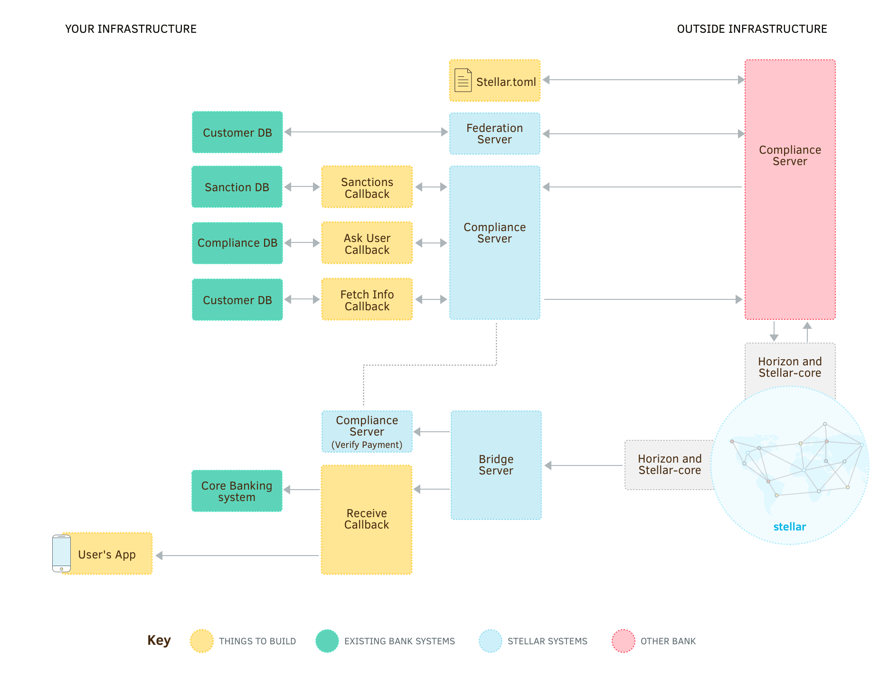

锚点的任务之一是处理监管合规，如反洗钱（<abbr title="Anti-Money Laundering">AML</abbr>）。为完成此任务，您应使用 [恒星合规协议](../compliance-protocol.md)，这是一个与其它金融机构交换合规信息和预验证事务的标准方式。

你可以编写自有服务来满足合规协议，但是Stellar.org 提供了一个 [合规服务](https://github.com/stellar/bridge-server/blob/master/readme_compliance.md) 可以为您完成大部分工作。

您的桥接服务在发送事务之前，会联络您的合规服务以获取授权。您的合规服务会使用合规协议与接收方的合规服务通讯以确认，然后通知桥接服务该事务可以发送。


当其它合规服务联系您来明确一个事务时，会使用一系列回调同您一起检查信息。然后，当您的桥接服务收到一个事务时，会联系您的合规服务验证该事务是否已经确认过。




## 创建数据库

合规服务需要一个 MySQL 或 PostgreSQL 数据库存储事务和合规信息。创建一个名为 `stellar_compliance` 的空数据库和用户即可。您无需创建/添加任何表，合规服务内含[一个命令会配置和更新您的数据库](#start-the-server)。


## 下载和配置合规服务

根据您的操作系统平台[下载最新的合规服务](https://github.com/stellar/bridge-server/releases)并将其安装到任意地方。在同一目录内创建一个名叫 `config_compliance.toml` 的文件。该文件用于存储配置。如下所示： 

<code-example name="config_compliance.toml">

```toml
external_port = 8003
internal_port = 8004
# 如果您需要检查接收方的信息时将此处设置为`true`（如果为false那么只有发送方会被检查）。
# 参阅下方回调部分寻找更多信息
needs_auth = false
network_passphrase = "Test SDF Network ; September 2015"

[database]
type = "mysql" # 或 "postgres" 如果你创建了一个 postgreSQL 数据库
url = "dbuser:dbpassword@/stellar_compliance"

[keys]
# 基本账户的密钥（或者可以替基本账户进行授权的账户密钥）
signing_seed = "SAV75E2NK7Q5JZZLBBBNUPCIAKABN64HNHMDLD62SZWM6EBJ4R7CUNTZ"
encryption_key = "SAV75E2NK7Q5JZZLBBBNUPCIAKABN64HNHMDLD62SZWM6EBJ4R7CUNTZ"

[callbacks]
sanctions = "http://localhost:8005/compliance/sanctions"
ask_user = "http://localhost:8005/compliance/ask_user"
fetch_info = "http://localhost:8005/compliance/fetch_info"

# 合规服务必须配置HTTPS，在此指定SSL证书及密钥文件。
# 如果合规服务在代理或负载均衡之后，此项可忽略
[tls]
certificate_file = "server.crt"
private_key_file = "server.key"
```

</code-example>

配置文件中列出了 `external_port` 和 `internal_port`。外部端口必须对外公开可用。这将用于其它组织与之联系来确定您是否接收该支付请求。

内部端口绝 *不* 应该对外开放。通过此端口您发起合规操作以及传递私有信息，您可以使用防护墙，代理及其它手段来保护它。

您还需告知您的桥接服务已有合规服务以供使用。更新 [`config_bridge.toml`](2-bridge-server.md#download-and-configure-bridge-server) 填入合规服务的*内部*端口地址：

<code-example name="config_bridge.toml">

```toml
port = 8001
horizon = "https://horizon-testnet.stellar.org"
network_passphrase = "Test SDF Network ; September 2015"
compliance = "https://your_org.com:8004"

# ...其余配置项
```

</code-example>


## 实现合规回调

在此服务的配置文件中，有三个回调URL，与桥接服务类似，用于接收POST方式提交过来的表单数据：

- `fetch_info` 接收一个联邦地址（如 `tunde_adebayo*your_org.com`），应返回所有必要信息以供其它组织进行合规检查。该信息可以是任何您认为合理的数据并被编码为JSON格式。

    当你发起支付时，它会被调用以获取当前发起者的客户信息，以便发送到接收组织。当接收支付请求时，如果发送组织请求接收者的信息以便他们进行合规检查时也会被调用。（基于 [`needs_auth` 配置项](#download-and-configure-compliance-server)）

    <code-example name="Implementing the fetch_info callback">

    ```js
    app.post('/compliance/fetch_info', function (request, response) {
      var addressParts = response.body.address.split('*');
      var friendlyId = addressParts[0];

      // 您需要创建 `accountDatabase.findByFriendlyId()`。它会通过恒星账户查询客户并返回信息。
      accountDatabase.findByFriendlyId(friendlyId)
        .then(function(account) {
          // 这里可以是任何您认为有用的信息，并不限于这三个字段。
          response.json({
            name: account.fullName,
            address: account.address,
            date_of_birth: account.dateOfBirth
          });
          response.end();
        })
        .catch(function(error) {
          console.error('Fetch Info Error:', error);
          response.status(500).end(error.message);
        });
    });
    ```

    ```java
    @POST
    @Path("compliance/fetch_info")
    @Consumes(MediaType.APPLICATION_FORM_URLENCODED)
    @Produces(MediaType.APPLICATION_JSON)
    public Response fetchInfo(
      @FormParam("address") String address) {

      String friendlyId = address.split("\\*", 2)[0];

      // 您需要创建 `accountDatabase.findByFriendlyId()`。它会通过恒星账户查询客户并返回信息。
      try {
        Account account = accountDatabase.findByFriendlyId(friendlyId);
        return Response.ok(
          // 这里可以是任何您认为有用的信息，并不限于这三个字段。
          Json.createObjectBuilder()
            .add("name", account.fullName)
            .add("address", account.address)
            .add("date_of_birth", account.dateOfBirth)
            .build())
          .build();
        )
      } catch (Exception error) {
        System.out.println(
          String.format("Could not find account: %s", address));
        return Response.status(500).entity(error.getMessage()).build();
      }
    }
    ```

    </code-example>

- `sanctions` 接收向您或者您的客户进行支付的发送方个人信息。即发送方服务通过其自有 `fetch_info` 回调获取到的信息。本回调产生的 HTTP 响应码表明该笔支付将会被接受（status `200`），拒绝（status `403`），或需要额外的处理时间（status `202`）。

    <code-example name="Implementing the sanctions callback">

    ```js
    app.post('/compliance/sanctions', function (request, response) {
      var sender = JSON.parse(request.body.sender);

      // 您需要创建一个函数检查是否有针对某些人的禁令。
      sanctionsDatabase.isAllowed(sender)
        .then(function() {
          response.status(200).end();
        })
        .catch(function(error) {
          // 本例中，我们假设 `isAllowed` 返回一个带有 `type` 属性的错误信息来表明错误类型，您的系统可能会与之不同。
          // 只需返回相同的 HTTP 状态代码。
          if (error.type === 'DENIED') {
            response.status(403).end();
          }
          else if (error.type === 'UNKNOWN') {
            // 如果您需要等待并执行手工检查，您也将需要创建一个方法。
            notifyHumanForManualSanctionsCheck(sender);
            // `pending` 的值是再次进行确认的时间间隔，单位为秒。
            response.status(202).json({pending: 3600}).end();
          }
          else {
            response.status(500).end(error.message);
          }
        });
    });
    ```

    ```java
    import java.io.*;
    import javax.json.Json;
    import javax.json.JsonObject;
    import javax.json.JsonReader;

    @POST
    @Path("compliance/sanctions")
    @Consumes(MediaType.APPLICATION_FORM_URLENCODED)
    @Produces(MediaType.APPLICATION_JSON)
    public Response sanctions(@FormParam("sender") String sender) {
      JsonReader jsonReader = Json.createReader(new StringReader(sender));
      JsonObject senderData = jsonReader.readObject();
      jsonReader.close();

      // 您需要创建一个函数检查是否有针对某些人的禁令。
      Permission permission = sanctionsDatabase.isAllowed(
        senderData.getString("name"),
        senderData.getString("address"),
        senderData.getString("date_of_birth"));

      // 本例中，我们假设 `isAllowed` 返回一个带有 `type` 属性的错误信息来表明错误类型，您的系统可能会与之不同。
      // 只需返回相同的 HTTP 状态代码。
      if (permission.equals(Permission.Allowed)) {
        return Response.ok().build();
      }
      else if (permission.equals(Permission.Denied)) {
        return Response.status(403).build();
      }
      else {
        // 如果您需要等待并执行手工检查，您也将需要创建一个方法。
        notifyHumanForManualSanctionsCheck(senderData);
        // `pending` 的值是再次进行确认的时间间隔，单位为秒。
        return Response.accepted(
          Json.createObjectBuilder()
            .add("pending", 3600)
            .build())
          .build();
      }
    }
    ```

    </code-example>

- `ask_user` 在收到支付时如果发送方请求接收方信息时被调用。本回调产生的 HTTP 响应码表明您是否会发送该信息（ `fetch_info` 随即被调用以*获取*实际信息）。它会发送有关支付和发送方的信息。

    <code-example name="Implementing the ask_user callback">

    ```js
    app.post('/compliance/ask_user', function (request, response) {
      var sender = JSON.parse(request.body.sender);

      // 你可以在此执行任何有意义的检查。例如您也许不想与某些禁令在身的人分享信息。
      sanctionsDatabase.isAllowed(sender)
        .then(function() {
          response.status(200).end();
        })
        .catch(function(error) {
          if (error.type === 'UNKNOWN') {
            // 如果您需要等待并执行手工检查，您也将需要创建一个方法。
            notifyHumanForManualInformationSharing(sender);
            // `pending` 的值是再次进行确认的时间间隔，单位为秒。
            response.status(202).json({pending: 3600}).end();
          }
          else {
            response.status(403).end();
          }
        });
    });
    ```

    ```java
    @POST
    @Path("compliance/ask_user")
    @Consumes(MediaType.APPLICATION_FORM_URLENCODED)
    @Produces(MediaType.APPLICATION_JSON)
    public Response askUser(@FormParam("sender") String sender) {
      JsonReader jsonReader = Json.createReader(new StringReader(sender));
      JsonObject senderData = jsonReader.readObject();
      jsonReader.close();

      // 你可以在此执行任何有意义的检查。例如您也许不想与某些禁令在身的人分享信息。
      Permission permission = sanctionsDatabase.isAllowed(
        senderData.getString("name"),
        senderData.getString("address"),
        senderData.getString("date_of_birth"));

      if (permission.equals(Permission.Allowed)) {
        return Response.ok().build();
      }
      else if (permission.equals(Permission.Denied)) {
        return Response.status(403).build();
      }
      else {
        // 如果您需要等待并执行手工检查，您也将需要创建一个方法。
        notifyHumanForManualInformationSharing(senderData);
        // `pending` 的值是再次进行确认的时间间隔，单位为秒。
        return Response.accepted(
          Json.createObjectBuilder()
            .add("pending", 3600)
            .build())
          .build();
      }
    }
    ```

    </code-example>

简单起见，我们会将这三个回调和桥接服务放在一起。您可以随意将它们部署在您的基础架构中，只要确保在配置文件中的URL正确即可。


## 更新Stellar.toml

当其它组织需要联系您的合规服务对到您客户的某笔支付进行授权时，他们会查阅您域名下的 `stellar.toml` 文件来定位服务，就像查找联邦服务一样。

对于合规操作，您需要在 `stellar.toml` 中列出两个新的属性：

<code-example name="stellar.toml">

```toml
FEDERATION_SERVER = "https://www.your_org.com:8002/federation"
AUTH_SERVER = "https://www.your_org.com:8003"
SIGNING_KEY = "GAIGZHHWK3REZQPLQX5DNUN4A32CSEONTU6CMDBO7GDWLPSXZDSYA4BU"
```

</code-example>

`AUTH_SERVER` 是您的合规服务的*外部*端口。如同联邦服务，这可以是任意您喜欢的URL，但**必须配置HTTPS，并使用有效的SSL证书。** [^ssl]

`SIGNING_KEY` 是您的合规服务配置里 `signing_seed` 对应的公钥。其它组织会使用该公钥来验证消息是否由您发送。


## 启动服务

在第一次启动服务之前，必须创建数据库表。使用 `--migrate-db` 参数运行合规服务会确定万事俱备：

```bash
./compliance --migrate-db
```

每次升级升级合规接服务时，您都应运行此命令。这会在有变动时升级数据库。

现在您的数据库已经准备好，你可以使用下述命令启动合规服务：

```bash
./compliance
```


## 试用一下

现在您的合规服务已经启动并准备验证事务，您需要向某些已运行合规服务和联邦服务的组织发起一笔支付来测试一下。

最简单的方式是发起一笔您的两位客户之间的付款。您的合规服务，联邦服务，以及桥接服务都会执行发送和接收端的操作。

通过桥接服务发起支付，但此时，发送方和接收方均使用联邦地址，并附加 `extra_memo`[^compliance_memos] 来触发合规检查：

<code-example name="Send a Payment">

```bash
# 注： `extra_memo` 为必须字段如要进行合规检查（替代 `memo`）
curl -X POST -d \
"id=unique_payment_id&\
amount=1&\
asset_code=USD&\
asset_issuer=GAIUIQNMSXTTR4TGZETSQCGBTIF32G2L5P4AML4LFTMTHKM44UHIN6XQ&\
destination=amy*your_org.com&\
source=SAV75E2NK7Q5JZZLBBBNUPCIAKABN64HNHMDLD62SZWM6EBJ4R7CUNTZ&\
sender=tunde_adebayo*your_org.com&\
extra_memo=Test%20transaction" \
http://localhost:8001/payment
```

```js
var request = require('request');

request.post({
  url: 'http://localhost:8001/payment',
  form: {
    id: 'unique_payment_id',
    amount: '1',
    asset_code: 'USD',
    asset_issuer: 'GAIUIQNMSXTTR4TGZETSQCGBTIF32G2L5P4AML4LFTMTHKM44UHIN6XQ',
    destination: 'amy*your_org.com',
    source: 'SAV75E2NK7Q5JZZLBBBNUPCIAKABN64HNHMDLD62SZWM6EBJ4R7CUNTZ',
    sender: 'tunde_adebayo*your_org.com',
    // `extra_memo` 为必须字段如要进行合规检查（替代 `memo`）
    extra_memo: 'Test transaction',
  }
}, function(error, response, body) {
  if (error || response.statusCode !== 200) {
    console.error('ERROR!', error || body);
  }
  else {
    console.log('SUCCESS!', body);
  }
});
```

```java
import org.apache.http.HttpEntity;
import org.apache.http.HttpResponse;
import org.apache.http.NameValuePair;
import org.apache.http.client.HttpClient;
import org.apache.http.client.methods.HttpPost;
import org.apache.http.impl.client.HttpClients;
import org.apache.http.message.BasicNameValuePair;
import org.apache.http.util.EntityUtils;

import java.util.ArrayList;
import java.util.List;

public class PaymentRequest() {
  public static void main(String [] args) {
    HttpPost paymentRequest = new HttpPost("http://localhost:8001/payment");

    List<NameValuePair> params = new ArrayList<NameValuePair>();
    params.add(new BasicNameValuePair("id", "unique_payment_id"));
    params.add(new BasicNameValuePair("amount", "1"));
    params.add(new BasicNameValuePair("asset_code", "USD"));
    params.add(new BasicNameValuePair("asset_issuer", "GAIUIQNMSXTTR4TGZETSQCGBTIF32G2L5P4AML4LFTMTHKM44UHIN6XQ"));
    params.add(new BasicNameValuePair("destination", "amy*your_org.com"));
    params.add(new BasicNameValuePair("source", "SAV75E2NK7Q5JZZLBBBNUPCIAKABN64HNHMDLD62SZWM6EBJ4R7CUNTZ"));
    params.add(new BasicNameValuePair("sender", "tunde_adebayo*your_org.com"));
    // `extra_memo` 为必须字段如要进行合规检查（替代 `memo`）
    params.add(new BasicNameValuePair("extra_memo", "Test transaction"));

    HttpResponse response = httpClient.execute(paymentRequest);
    HttpEntity entity = response.getEntity();
    if (entity != null) {
      String body =  EntityUtils.toString(entity);
      System.out.println(body);
    }
  }
}
```

</code-example>

要进一步测试，使用不同的域名搭建两套桥接服务，联邦服务和合规服务，然后在两者之间进行支付吧！

<nav class="sequence-navigation">
  <a rel="prev" href="3-federation-server.md">上一章节：联邦服务</a>
  <a rel="next" href="5-conclusion.md">下一章节：下一步</a>
</nav>


[^compliance_memos]: 使用桥接服务进行合规事务检查时不支持 `memo` 字段。真正的`memo`将会存储一个 hash 值，可以用于确认提交到恒星网络的事务与合规检查时约定的是否相同。合规检查时将使用 `extra_memo` 数据替代。查阅 [合规协议](../compliance-protocol.md)获取详情。

[^ssl]: 公共服务需要SSL证书来保证安全。测试期间，你可以从 http://letsencrypt.org 获取到免费证书。你也可以自行签署证书，但需要自行在测试环境中部署该证书。
