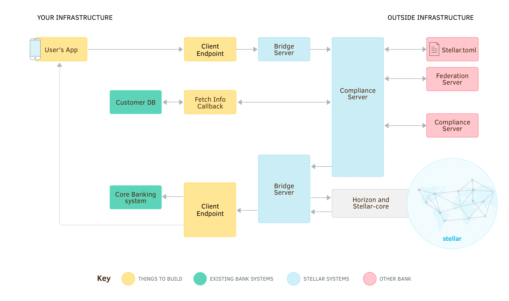

锚点是人们信任的实体，可以持有用户的存入款项并在恒星网络上对应地[发行资产](../issuing-assets.md)。恒星中所有运转的资产（除XLM以外）均由锚点发行而产生，所以锚点在现有货币和恒星中扮演桥梁的角色。大多数锚点均以组织的形式存在，如银行，储蓄机构，合作社，中央银行，以及汇款公司等等。

在继续前，您应该熟悉下列概念：

- [发行资产](../issuing-assets.md)， 锚点的最基础行为动作。
- [联邦协议](../concepts/federation.md)， 可以允许单个恒星账户指代多个人。
- [合规协议](../compliance-protocol.md)，如果您受到任何金融监管。

## 账户架构

作为锚点，您至少要维护两个账户：

- 一个只用来发行和销毁资产的 **发行账户**
- 一个用于处理其它事务的 **基本帐户** ，持有由*发行账户*发行的资产。

使用 [laboratory](https://stellar.org/laboratory/) 在测试网络创建这两个账户，或者使用[“get started”指南](../get-started/create-account.md)中的步骤创建。

在此指南中，我们使用以下密钥对：

<dl>
  <dt>发行账户ID</dt>
  <dd><code>GAIUIQNMSXTTR4TGZETSQCGBTIF32G2L5P4AML4LFTMTHKM44UHIN6XQ</code></dd>
  <dt>发行账户密钥</dt>
  <dd><code>SBILUHQVXKTLPYXHHBL4IQ7ISJ3AKDTI2ZC56VQ6C2BDMNF463EON65U</code></dd>
  <dt>基本帐户ID</dt>
  <dd><code>GAIGZHHWK3REZQPLQX5DNUN4A32CSEONTU6CMDBO7GDWLPSXZDSYA4BU</code></dd>
  <dt>基本账户Seed</dt>
  <dd><code>SAV75E2NK7Q5JZZLBBBNUPCIAKABN64HNHMDLD62SZWM6EBJ4R7CUNTZ</code></dd>
</dl>

### 客户账户

有两种简单的方式来统计账户的资金：
There are two simple ways to account for your customers’ funds:

1. 为每个客户维护一个恒星账户。当客户从您的机构存入资金，您应该从*基本账户*上支付等量的资产到客户的恒星账户。当用户需要获得实际货币时，从他们的账户上减去等量的资产。

    这种方式使用恒星网络而不是自有内部网系统，从而简化了记账。这样也可以让客户能够更多的控制其恒星账户运作的方式。

2. 使用 [联邦协议](../concepts/federation.md) 和 事务中的[`memo`](../concepts/transactions.md#memo) 字段来代表客户进行收发款项。这种方式为您的客户进行的交易，都是使用*基本账户*进行。e 事务的`memo`字段用来标记支付对应的实际客户。

    使用单一账户需要您进行附加的记账工作，但也意味着您只需保管少量的密钥对，以及更好的控制账户。如果您已有类似的银行系统。这是与恒星集成最简单的方式。

您也可以基于此创建您自己的方式。 **在此指南中，我们使用第二种方式——使用一个恒星账号来代表客户进行交易。**

## 数据流 

为了运营锚点，您的基础架构需要：

- 发起支付。
- 监控某个恒星账户，当有支付过来时更新客户的账户信息。
- 查询和回应对联邦地址的请求。
- 遵守反洗钱（AML）规定。

恒星提供了预先编译好的[联邦服务](https://github.com/stellar/go/tree/master/services/federation) 和 [合规服务](https://github.com/stellar/bridge-server/blob/master/readme_compliance.md)，可以用来安装和与您的现有基础设施进行集成。[桥接服务](https://github.com/stellar/bridge-server/blob/master/readme_bridge.md) 可以与他们协同，并简化与恒星网络的交互工作。 本指南会演示如何将它们与您的基础架构进行集成，但您也可以自行编写软件并进行集成。

### 发起支付

使用上述服务时，使用联邦协议和合规协议的复杂付款会如下工作：

1. 客户使用您组织的应用或网站提供的服务发起付款。
2. 您的内部服务使用桥接服务发送付款。
3. 桥接服务确定是否需要合规性检查，并将交易信息转发给合规服务。
4. 合规服务通过查找联邦地址来确定接收账户ID。
5. 合规服务与您的内部服务联系，获取发送付款的客户的信息，以便将其提供给接收组织的合规系统。
6. 如果合规结果成功，桥接服务将创建事务，对其进行签名，然后将其发送到恒星网络。
7. 在网络确认交易后，桥接服务会将结果返回给您的服务，该服务应更新您客户的账户。

### 接收支付：

当有人向你发送交易时，流程有所不同：

1. 发送方向您的联邦服务发起查询客户的联邦地址操作，并获得恒星账户ID以便发送付款。
2. 发送方会与您的合规服务联系，提供有关付款人的信息。
3. 您的合规服务会联系三项服务，您需要自行实现：
    1. 一个禁令回调服务，用以确定是否允许该付款人向您的客户付款。
    2. 如果发送方想要检查客户的信息，则会使用一个回调服务来确定您是否愿意分享客户信息。
    3. 步骤3.2的回调服务，还可用于实际获取客户信息。
4. 发送方将事务提交到恒星网络。
5. 桥接服务就此事务监控恒星网络，发现后将其发送到您的合规服务，以验证它是您在步骤3.1中批准的同一事务。
6. 桥接服务会联系您自行实现的另一服务，以通知您有关该事务的信息。您可以使用此步骤更新客户的账户余额。

**虽然这些步骤看起来很复杂，但恒星的桥接服务，联邦服务和合规服务可以完成大部分工作。** 您只需要实现4个回调服务，并创建一个[stellar.toml](../concepts/stellar-toml.html)文件用于别人查询服务的URL即可。

接下来，我们将逐步介绍如何配置这些基础设施的每一部分。

<nav class="sequence-navigation">
  <a rel="next" href="2-bridge-server.md">下一章节：桥接服务</a>
</nav>
